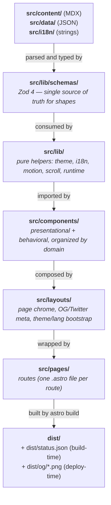
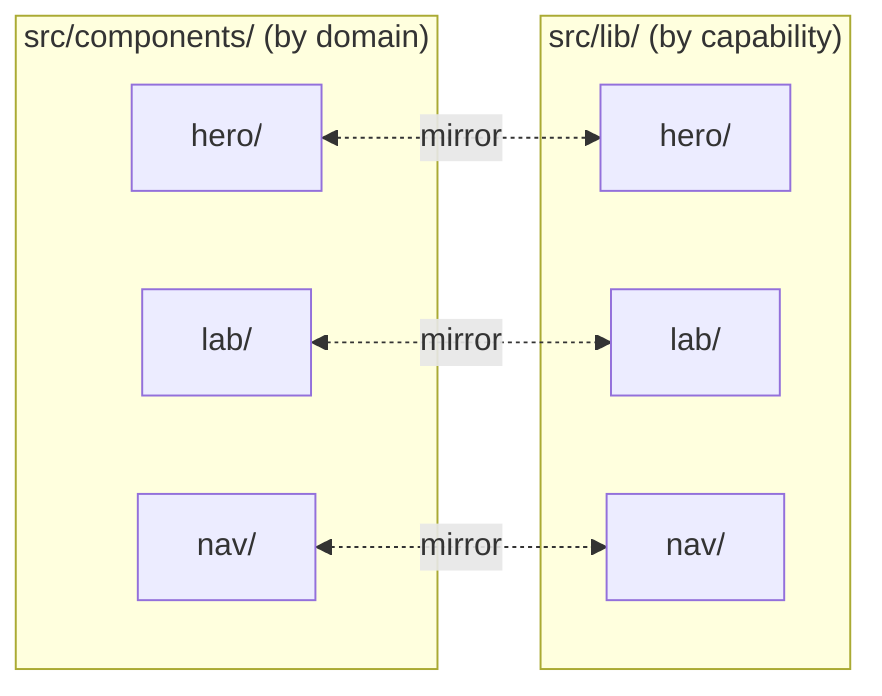
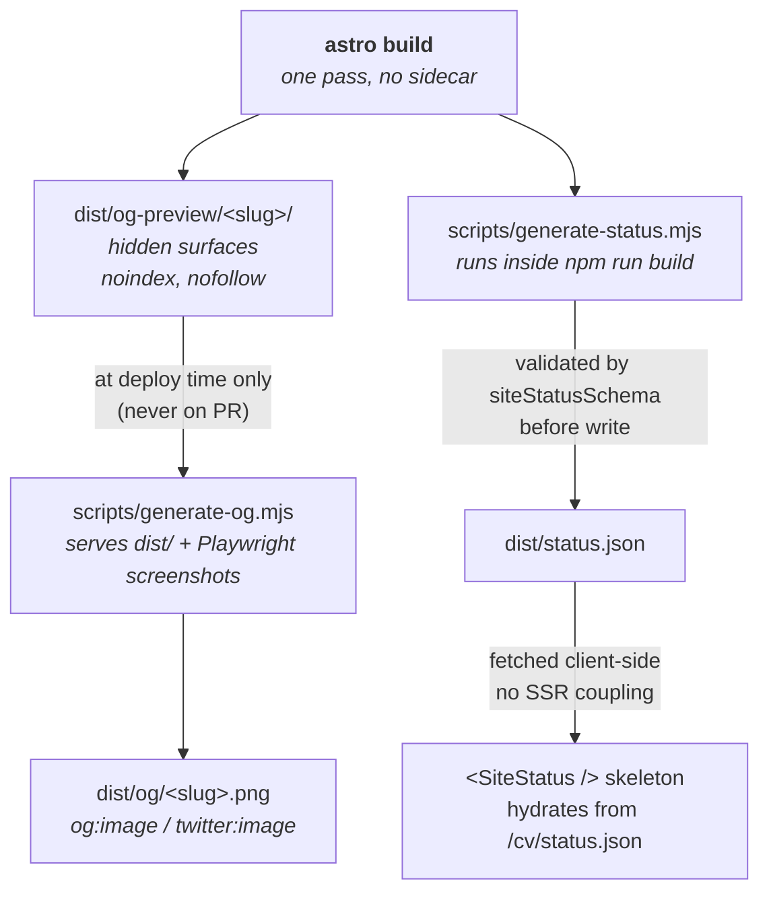
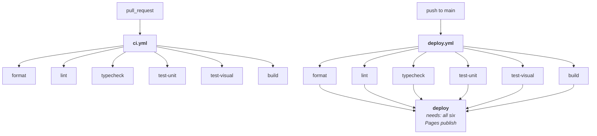

# Jesús Cocaño — cv

> _My CV as an app. Not a PDF. Same discipline I'd use in production._

[](https://github.com/jcocano/cv/actions/workflows/ci.yml) [](https://github.com/jcocano/cv/actions/workflows/deploy.yml) [](https://astro.build)

→ **[jcocano.github.io/cv](https://jcocano.github.io/cv)** &nbsp;·&nbsp; [The system](https://jcocano.github.io/cv/the-system/) &nbsp;·&nbsp; [Projects](https://jcocano.github.io/cv/projects/)

## What this is

A bilingual (ES/EN), static, zero-runtime-framework site. Astro 6 + strict TypeScript 6 + Zod 4 + plain CSS modules. Content lives in MDX collections validated by Zod schemas. Every page × theme × language is locked behind byte-exact Playwright visual baselines, every PR is gated by six parallel CI checks, and accessibility is checked twice (axe-core via JSDOM in unit tests, axe-core via Playwright in the browser for color-contrast). Deployed to GitHub Pages on every green push to `main`, with OG cards regenerated from the live site at deploy time.

If you want the engineering rationale, jump to [Decisions](#decisions). If you want to see how that rationale is wired into the repo, start with [Architecture](#architecture). If you want to run it, jump to [Run locally](#run-locally).

## Why this exists

It started as a utility. A quick way to share a CV link instead of attaching a PDF every time. Eventually it turned into a portfolio. Today it's read by a mixed audience: recruiters skimming the repo, curious visitors landing from my profile, and engineering folks who want to see how I work.

Astro because building a backend for content that barely changes felt like over-engineering. Static output keeps it fast, MDX lets me write content without a CMS, it's framework-agnostic, and the MCP integration was a nice bonus.

## Architecture

Every decision in this project is meant to be visible from the architecture. If the directory tree doesn't tell you what I optimized for, I did something wrong. The subsections below walk the system in dependency order — what exists, how layers compose, where the boundaries are, and what gets produced when.

### 1. Routes

Five routes, all statically generated, all bilingual via a `data-lang` attribute on `<html>`:

| Route                 | Purpose                                                                                           |
| --------------------- | ------------------------------------------------------------------------------------------------- |
| `/`                   | Hero, summary, AI-ready, lab, experience, stack, selected work, contact.                          |
| `/projects/`          | Index of every case study from the `projects` content collection.                                 |
| `/projects/<slug>/`   | One MDX case study per project, rendered through `ProjectLayout`.                                 |
| `/the-system/`        | Technical handbook: principles, decisions, type/spacing/UI primitives, tokens, live build status. |
| `/og-preview/<slug>/` | Hidden 1200×630 surfaces that the OG generator screenshots at deploy time. `noindex,nofollow`.    |

`/og-preview/` exists only as a canvas for the OG generator — users never land on it. That separation between "what users read" and "what crawlers consume" is what lets the OG cards reuse the live site's fonts and tokens without forking a second design system. Details in [§6 Build pipeline](#6-build-pipeline-producer--pipeline-separation).

### 2. Layers & dependency direction



Arrows go one way. Schemas never import components. Components never import pages. Build-time artifacts (`dist/status.json`, `dist/og/`) are produced _after_ `astro build` exits, never during SSR — so there's no circular dependency between "the build" and "what the build needs to read." Details in [§6 Build pipeline](#6-build-pipeline-producer--pipeline-separation).

### 3. Boundaries: every layer crosses through Zod

Everything that crosses a layer crosses through a Zod schema first.

| Crossing                                                                                                          | Schema (`src/lib/schemas/`) | Fails the build if…                         |
| ----------------------------------------------------------------------------------------------------------------- | --------------------------- | ------------------------------------------- |
| `src/content/experience/*.mdx`                                                                                    | `experience.ts`             | Frontmatter is missing or wrong-typed.      |
| `src/content/projects/*.mdx`                                                                                      | `projects.ts`               | Same.                                       |
| `src/content/side-projects/*.mdx`                                                                                 | `side-projects.ts`          | Same.                                       |
| `src/content/oss-projects/*.mdx`                                                                                  | `oss-projects.ts`           | Same.                                       |
| `src/content/publications/*.mdx`                                                                                  | `publications.ts`           | Same.                                       |
| `src/data/*.json` (hero, summary, stack, principles, lab, ai-ready, technical-decisions, design-system-decisions) | one schema per file         | A data block ships in the wrong shape.      |
| i18n strings                                                                                                      | `i18n-string.ts`            | A translation has only one of `{ es, en }`. |
| Design tokens                                                                                                     | `tokens.ts`                 | A token name or value drifts.               |
| `dist/status.json` (build-time)                                                                                   | `site-status.ts`            | The build artifact itself is malformed.     |

This is what "no `any`" means in practice: types don't come from hand-written interfaces, they come from Zod schemas parsed against real files. There is nowhere for a wrong shape to hide.

### 4. Content & i18n: data lives outside the components

Content is in `src/content/` (MDX) and `src/data/` (JSON). Components are intentionally dumb: they take props, render markup, maybe wire one behavior module. They don't know where the content came from.

This is the boundary that makes the site editable:

- A new case study is a new `.mdx` file. No `.astro` file changes.
- A new principle is a JSON entry. No `.astro` file changes.
- A new translation key fails the build until both `es` and `en` exist.

i18n stays on a single URL tree — Astro ships native `/es/...` / `/en/...` routing, but I didn't use it:

```
<html lang="es" data-lang="es">              bootstrap script reads localStorage before paint
  ...
  <span lang="es">Hola</span>                CSS hides the inactive one via
  <span lang="en">Hello</span>               [data-lang="..."] attribute selectors
  ...
</html>
```

The language toggle mutates `data-lang` on the root element — no client routing, no re-render. One URL tree, no drift, no two-tree maintenance. The SEO `lang` attribute stays correct because the bootstrap script runs before paint.

### 5. Components and lib mirror each other

Folder names are an architectural contract. A change to "the hero" should touch exactly two folders (`components/hero/` + `lib/hero/`), never three or eleven.



The full layout:

```
src/components/
├── design-system/   only used inside /the-system/
├── hero/            mirrors lib/hero/
├── lab/             mirrors lib/lab/
├── nav/             mirrors lib/nav/
├── og/              used only by /og-preview/
├── principles/      only used inside /the-system/
├── projects/        MDX building blocks (Metric, ArchDiagram)
├── sections/        top-level blocks composed by /index.astro
├── ui/              shared primitives
└── work/            project cards, lists, publication rows
```

```
src/lib/
├── content/         collection validators
├── footer-utils/    footer-only helpers
├── hero/            hero-only helpers
├── i18n/            language toggle, t()
├── lab/             lab-only motion + state
├── motion/          shared motion utilities
├── nav/             nav-only helpers
├── runtime/         console signature, window envs, build label
├── schemas/         every Zod schema (the boundary above)
├── scroll/          shared scroll observers
├── styles/          style helpers
├── the-system/      /the-system/-only helpers
└── theme/           theme toggle
```

If a helper is used by exactly one component family, it lives next to that family. Shared helpers live at the lib root (`motion/`, `scroll/`). Cross-cutting concerns get their own root folders (`schemas/`, `runtime/`). Finding the helper that powers a component is a one-folder hop.

Each component owns its own `.module.css` next to it. The `npm run check:styles` CI gate fails if a component ships an inline `<style>` block that isn't `is:global`, so "one stylesheet per component" is enforced by CI rather than by reviewer discipline.

### 6. Build pipeline: producer / pipeline separation

Two artifacts the site needs don't exist until `dist/` is built:

- `dist/status.json` — page weight, JS payload, CSS payload, route count, build SHA, build time.
- `dist/og/<slug>.png` — 1200×630 OG cards for every route.

Both are produced _after_ `astro build` exits, never during SSR. That separation is what keeps the build a single pass.



`<SiteStatus />` doesn't read `dist/status.json` during SSR because it would create a circular dependency: the component depends on the very build output it's part of. So the component ships a skeleton and the metrics fetch at runtime. One `astro build` pass. No sidecar. No two-pass convergence.

OG cards follow the same logic: instead of regenerating SVGs from a second design system in Satori, hidden `/og-preview/<slug>/` pages render with the real fonts, tokens, and `oklch()` colors, then Playwright screenshots them at deploy time. One source of truth for what the brand looks like.

### 7. CI/CD: composed, not duplicated

Six reusable workflows under `.github/workflows/` each own exactly one responsibility and expose `workflow_call`. Two top-level workflows compose them:



`ci.yml` exists so a PR shows one `CI` run with six side-by-side jobs in the Actions tab, instead of six independent workflow runs. `deploy.yml` reuses the same six checks, then ships `dist/` to GitHub Pages via `actions/upload-pages-artifact@v5` + `actions/deploy-pages@v5`. Zero copy-paste between PR-gating and deploy-gating. Concurrency is pinned to one in-flight deploy per `pages` group — a new push to `main` cancels the deploy in progress.

The Pages deploy step is also the only place Playwright Chromium gets installed: visual tests run inside the official Playwright container, and OG generation only happens on `main`, so PR-side jobs never carry a Chromium dependency.

## Decisions

The architecture above is the _how_. This section is the _why_ — decisions I made deliberately and would defend in a code review:

- **No `any` in TypeScript, anywhere, including tests.** If I'm tempted to reach for `any`, that's a smell. Either the type is wrong or the logic is. Strong typing isn't just a safety net — it's how I know, at every moment, where I am in the code and what I expect to happen next. When something is genuinely dynamic I reach for `unknown` + narrowing, generics, or a Zod-derived type. The few extra minutes of modeling pay back the same day, not in some imaginary future refactor. Enforced in the architecture by [§3 the schema layer](#3-boundaries-every-layer-crosses-through-zod): types flow from Zod schemas parsed against real files, not from hand-rolled interfaces that can drift.

- **TDD, but only where it pays.** Unit tests for logic and helpers. Render-tests (via `experimental_AstroContainer`) for components with branching. No tests on pure presentational templates: visual parity already covers those. I don't believe in test theater for stateless markup.

- **One URL set serves both languages.** I'm Mexican, and the site being bilingual was a dealbreaker for me — a small way of keeping my roots in the project. Astro ships native i18n routing (`/es/...`, `/en/...`), but I didn't want to maintain two URL trees just to be polite to language detectors. So every translatable string is `{ es, en }`, validated by Zod, and the language toggle just mutates a `data-lang` attribute on the root. One tree, no drift. ¡Viva México, cabrones! 🌮 See [§4](#4-content--i18n-data-lives-outside-the-components) for how it's wired.

- **Vanilla TypeScript, no UI framework.** Not everything needs React. For a site this size, picking a UI framework is choosing 30-50 KB of runtime to solve a problem you don't have. The theme toggle, language toggle, scroll observers, and the Lab pieces are all plain script modules from `src/lib/`. Zero framework runtime, faster paint, and anyone reading the source can follow the behavior without learning a framework first. Frameworks earn their keep in apps. On small sites, they're just runtime tax.

- **Plain CSS modules, no Tailwind.** I genuinely love Tailwind — the velocity is hard to argue with, and I think it deserves more credit than it gets in some circles. But once I'd committed to no UI framework, pulling in Tailwind felt incoherent: a site with zero JS runtime shouldn't carry a CSS engine to compensate. So each component owns its `.module.css`, design tokens live in one `tokens.css`, and total CSS sits around 2 KB. The `check:styles` CI gate enforces this rather than leaving it to reviewer discipline.

- **OG cards are screenshots of the real site, not Satori SVGs.** The OG card reuses the site's variable fonts, CSS custom properties, and `oklch()` accent colors. Satori only supports a subset of CSS and would force a parallel design system. Screenshotting the live site at 1200×630 keeps "what the site looks like" and "what the OG card looks like" aligned with no second source of truth. See [§6](#6-build-pipeline-producer--pipeline-separation).

- **Producer/pipeline separation for build artifacts.** The `<SiteStatus />` block needs build metrics that only exist after `astro build`. Reading them from a component during SSR creates a circular dependency that needs a two-pass build to converge. So the component renders an `aria-busy="true"` skeleton, and a tiny client-side module fetches `dist/status.json` at runtime. One pass, no sidecar.

- **Components by domain, lib mirrored by capability.** Folder names are an architectural contract, not a filing convention. A change to "the hero" should touch exactly two folders, never three or eleven. That mirror shape is what lets a new contributor read the directory tree and predict where everything lives.

Full rationale and the alternatives I rejected live in [the technical decisions block](https://jcocano.github.io/cv/the-system/#block-technical-decisions). Day-to-day principles are written down in [Principles](https://jcocano.github.io/cv/the-system/#block-principles).

## Testing & quality bar

| Layer                 | Tool                                                          | What it locks down                                                                                                                  |
| --------------------- | ------------------------------------------------------------- | ----------------------------------------------------------------------------------------------------------------------------------- |
| Logic / helpers       | Vitest 4                                                      | Pure functions, Zod schemas, content validators, runtime modules.                                                                   |
| Astro components      | Vitest + `experimental_AstroContainer`                        | Branching markup, prop handling, i18n string selection.                                                                             |
| Build tooling         | Vitest (`tests/tooling/`, `scripts/__tests__/`)               | `sync-data-store`, `generate-status`, the `pretest` hook.                                                                           |
| A11y (structural)     | axe-core via JSDOM (`tests/a11y/axe.test.ts`)                 | `document-title`, `html-has-lang`, `button-name`, `link-name`, `image-alt`, zero violations across every page × theme × lang combo. |
| A11y (color contrast) | axe-core via Playwright (`tests/visual/axe-contrast.spec.ts`) | Color-contrast checks JSDOM can't evaluate because it doesn't resolve CSS custom properties.                                        |
| Visual regression     | Playwright 1.59 (`tests/visual/snapshots.spec.ts`)            | `maxDiffPixelRatio: 0.0` — a single byte fails the suite.                                                                           |
| Production artifact   | `astro build` in CI                                           | Catches build regressions independently of test results.                                                                            |

The visual side of the site is committed as [Playwright baselines](tests/visual/__snapshots__/) alongside the code — every page × theme × language captured as a PNG and compared with `maxDiffPixelRatio: 0.0`. Visual regressions show up as a normal file diff in any PR; you can browse the UI's evolution by following those PNGs through git history.

For that byte-exact comparison to hold across machines, the suite runs inside the official Playwright Docker image. Regenerate baselines locally with the same image so the PNGs match what CI produces:

```bash
docker run --rm -v "$PWD":/work -w /work \
  --user "$(id -u):$(id -g)" \
  mcr.microsoft.com/playwright:v1.60.0-noble \
  bash -c "npm ci && npm run build && npm run test:visual -- --update-snapshots"
```

Commit the updated PNGs under `tests/visual/__snapshots__/` in the same PR.

## Stack

- **Astro 6** — static site generator, MDX integration, content collections.
- **TypeScript 6** — strict, no `any`.
- **Zod 4** — schemas at every layer boundary.
- **Vitest 4** — unit, render (`experimental_AstroContainer`), a11y JSDOM, build tooling.
- **Playwright 1.59** — visual baselines and color-contrast a11y, byte-exact inside Docker.
- **axe-core 4** — accessibility audits in both JSDOM and the browser.
- **Plain CSS Modules** — no Tailwind, no preprocessor; tokens in one `tokens.css`.
- **Fontsource** — self-hosted Geist and JetBrains Mono variable fonts.
- **ESLint + Prettier + Husky + lint-staged** — formatter, linter, and pre-commit gate.
- **GitHub Pages** — static deploy via GitHub Actions.

## Run locally

```bash
npm ci
npm run dev          # local dev server at http://localhost:4321/cv/
npm run build        # static site to ./dist (also writes dist/status.json)
npm run build:og     # screenshot OG cards into dist/og/ (needs `npm run build` first)
npm run preview      # serve dist/ for manual inspection

npm test             # vitest: unit + render + a11y (JSDOM) + tooling
npm run test:watch   # vitest in watch mode
npm run test:visual  # playwright visual + axe-contrast suite

npm run typecheck    # astro check
npm run lint         # eslint
npm run format       # prettier --write
npm run format:check # prettier --check (CI-equivalent)
npm run check:styles # fails if a component ships a non-global <style> block
```

The `pretest` hook runs `tooling/sync-data-store.mjs` automatically so Vitest sees the same content data Astro does at build time.
